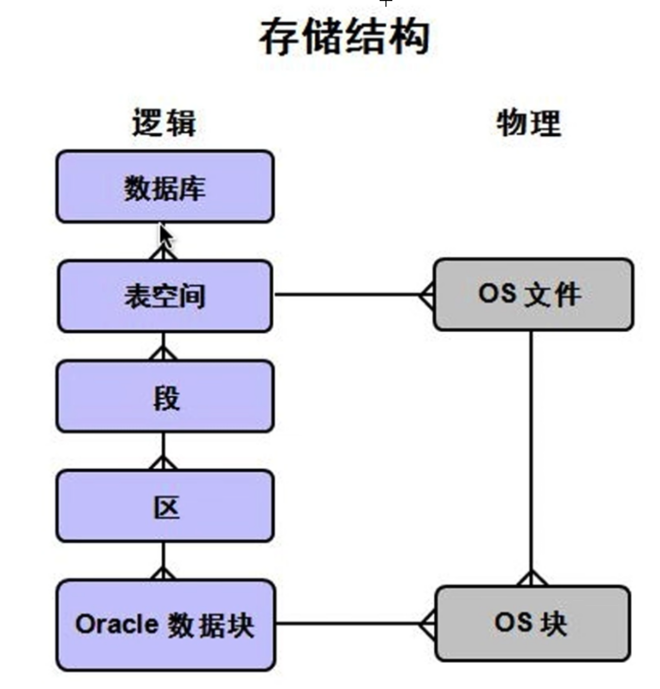

<p align="center">
 
 <h1 align="center">Oracle 数据库</h2>
 <p align="center"><b>笔记</b></p>
</p>


<div align=center>


[](LICENSE)


<div align=left>
<!-- 顶部至此截止 -->

# Oracle 简介

**Oracle实例：**位于物理内存的数据结构，它由操作系统的多个后台进程和一个共享的内存池所组成，共享的内存可以被所有进程访问。Oracle用它们来管理数据库访。用户如果要存取数据库（也就是硬盘上的文件）里的数据，必须通过Oracle实例能实现，不能直接读取硬盘上的文件。实际上，Oracle实例就是平常所说的数据库服务（service）。在任何时刻，一个实例只能与一个数据库关联，访问一个数据库；而同一个数据库可由多个实例访问（RAC）




# 表设计

## 表的概念

数据库中以表为组织单位存储数据。表用来存储一些事物的信息，首先需要有一个表名，以及存储的信息


## 约束

对于存储的没一个信息，都应该使用相应的数据进行表示，并且这些数据应该是合法的（包括实际和业务逻辑），在数据库中我们通过约束来对每个字段中的数据的合法性进行规范。

- 主键约束（PRIMARY KEY）
- 一性约束（UNIQUE）
- 非空约束（NOT NULL）
- 外键约束（FOREIGN KEY）
- 检查约束（CHECK）


# SQL 命令

## SELECT

- 基本语法

    ```sql
    SELECT 查询的信息 FROM 数据来源;
    ```


- **去重**

    ```sql
    SELECT DISTINCT 查询的信息 FROM 数据来源;
    ```


- **取别名**

    ```sql
    SELECT colName 别名 FROM ...;
    
    SELECT colName as 别名 FROM ...;
    ```

    

- **排序**

    ```sql
    -- 升序
    SELECT ...... ORDER BY 列明 ASC;
    
    -- 降序
    SELECT ...... ORDER BY 列明 DESC;
    
    -- 多字段排序
    -- 查询所有员工的姓名、工资、所在的部门的编号，按照部门编号升序排序，同一部门的员工，按照工资降序排序
    SELECT ename, sal, deptno FROM emp ORDER BY deptno ASC, sal DESC;
    ```

    

- **伪列和表达式**

    ```sql
    -- 查询用户姓名，工资, 1  <-- 这里的 1 就是伪列
    SELECT ename, sal, 1 from emp;
    
    -- 查询姓名，月工资，年薪（月薪*12），这里的年薪就是伪列
    SELECT ename, sal, sal*12 FROM emp;
    
    SELECT ename, sal, sal*12 as "年薪" FROM emp;
    ```

    

- **空值处理**

    **在进行表达式或者排序操作的时候会遇到对空值的处理**，其中：

    - 如果表达式运算中有一个列为空值，则结果为空

        `nvl(表达式或列，如果参数1为空的话使用的值)` - 可以**对 null 进行处理**

        ```SQL
        -- 查询员工月收入（工资+提成）
        select ename, sal, comm, sal+comm as "月收入" from emp; -- 如果表达式中有一个为 null，那么运算后的结果为 null
        
        -- nvl(表达式或列，如果参数1为空的话使用的值) 
        select ename, sal, comm, sal+NVL(comm， 0) as "月收入" from emp; -- 如果 comm 为空则使用 0 进行替代
        ```

        

    - 如果在排序中，被排序的行有的为空值，那么这些行无法被排序

        `nulls first` 将空值的放在最前面

        `nulls last` 将空值的都放在后面

        ```SQL
        -- 按照提成进行升序排序
        SELECT * FROM emp ORDER BY comm ASC;
        
        -- nulls first 将空值的放在最前面
        -- nulls last 将空值的都放在后面
        SELECT * FROM emp ORDER BY comm DESC NULLS FIRST;
        SELECT * FROM emp ORDER BY comm DESC NULLS LAST;
        ```

        

- **字符串拼接**

	`||` - 可以对字符串进行拼接
	
	```sqlite
	SELECT ename FROM emp;
	
	-- 名字后面都加上一个 fox` 
	SELECT ename, ename||'fox' AS This_is_Alisa FROM emp;
	-- 【重点】如果在字符串拼接时，遇到了null，那么对自动转换为空字符串，而不是也为 null！
	SELECT ename, comm , ename || comm AS null_merge FROM emp;
	```


​	
